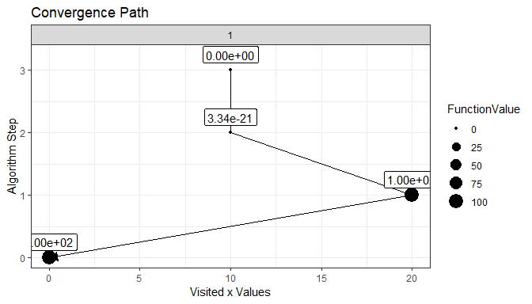
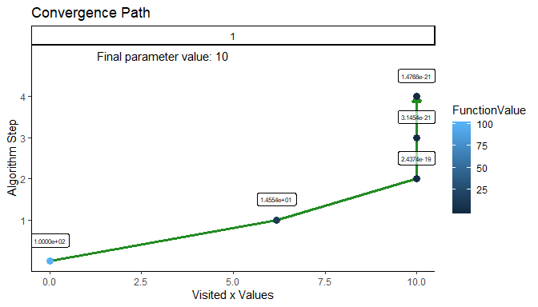

# optimizeAPA
Arbitrary Precision Arithmetic (APA) optimization algorithms implemented in R.

Throughout I will use the abreviations APA = "arbitrary precision arithmetic", and NAPA="non arbitrary precision arithmetic".

The APA in this package is achieved using the packages Rmpfr and gmp.

# Installation


```r
install.packages("devtools")
devtools::install_github("mrparker909/optimizeAPA")
```

## Currently Implemented:

- optim_DFP_NAPA (non-APA version of DFP algorithm)
- optim_DFP_APA (APA version of DFP algorithm)

## Currently In Progress:

- optim_BFGS_NAPA (non-APA version of BFGS algorithm)
- optim_BFGS_APA (APA version of BFGS algorithm)

# Some Illustrative Examples

## optimDFP_APA


```r
library(optimizeAPA)

# notice that the function must be made using APA arithmetic from the package Rmpfr
# the function inputs are first: the parameter to be optimized over (x)
# and must also include the variable precBits, to be passed to all APA numbers.
# Any other function parameters (such as center) can be passed to the function
# when calling optim_DFP_APA

# function we would like to optimize:
quadratic <- function(x, center, precBits=64) {
  x_apa <- Rmpfr::mpfr(x,precBits) # convert input to APA
  (x_apa-center)^2
}

# APA optimization
optim_DFP_APA(starts=0, func=quadratic, center=10, precBits = 64)
```

```
## $x
## 'mpfrMatrix' of dim(.) =  (1, 1) of precision  64   bits 
##      [,1]                 
## [1,] 10.000000000000000000
## 
## $f
## 'mpfrMatrix' of dim(.) =  (1, 1) of precision  64   bits 
##      [,1]                 
## [1,] 0.0000000000000000000
## 
## $grad
## 1 'mpfr' number of precision  64   bits 
## [1] 0
## 
## $inv_Hessian
## 'mpfrMatrix' of dim(.) =  (1, 1) of precision  64   bits 
##      [,1]                  
## [1,] 0.50000000000226056695
## 
## $steps
## [1] 3
## 
## $converged
## [1] TRUE
```
The minimum is attained at $x_{min}=10$, where the function is found to be $f(x_{min})=0$, and the gradient is $grad(f(x_{min})) = 0$.

We can compare these results to the optim_DFP_NAPA results, and to the regular optim results: 


```r
# function we would like to optimize:
quadratic_NAPA <- function(x, center) {
  (x-center)^2
}

# NAPA optimization
optim_DFP_NAPA(starts=0, func=quadratic_NAPA, center=10)
```

```
## $x
##      [,1]
## [1,]   10
## 
## $f
##      [,1]
## [1,]    0
## 
## $grad
## [1] 0
## 
## $inv_Hessian
##      [,1]
## [1,]  0.5
## 
## $steps
## [1] 3
## 
## $converged
## [1] TRUE
```

```r
optim(par=0, fn=quadratic_NAPA, hessian=TRUE, method="BFGS", center=10)
```

```
## $par
## [1] 10
## 
## $value
## [1] 2.839899e-29
## 
## $counts
## function gradient 
##       11        3 
## 
## $convergence
## [1] 0
## 
## $message
## NULL
## 
## $hessian
##      [,1]
## [1,]    2
```

It can be desirable to retain the convergence path for diagnosis and visualization purposes. This can be done easily with both the APA and NAPA version of the optimization algorithm:


```r
library(ggplot2) # ggplot for plotting

# just set keepValues to TRUE to keep every visited value
op <- optim_DFP_NAPA(starts=0, func=quadratic_NAPA, center=10, keepValues = TRUE)

# convergence path plot:
plotConvergence(op) + ggtitle("Convergence Path")
```

<!-- -->

And the same for the APA version:


```r
# just set keepValues to TRUE to keep every visited value
op <- optim_DFP_APA(starts=0, func=quadratic, center=10, keepValues = TRUE)

# convergence path plot:
plotConvergence(op)
```

<!-- -->
